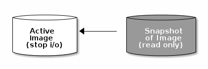

CEPH BLOCK DEVICE¶


## 1. Defined 
- Một block là một chuỗi byte ( 512 byte là một block data. ). Block storage là  phương thức lưu trữ dữ liệu giống như  hard disks, CD, floppy disks. 

- Cơ chế block storage trong Ceph là thin-provisioned, có khả năng co giãn, lưu trữ dữ liệu được chia nhỏ trên nhiều OSD. Ceph block storage tận dụng khả năng của RADOS : snapshot, replication, và tính nhất quán của dữ liệu 

cd 


- Ceph block device khả năng làm việc mà mở rộng m, khả năng hiệu năng cao  với Kernel Virtual Machine ( KVM ) , các cloud-based như Openstack, Cloudstack. 

## 2. Khởi tạo  BLOCK DEVICE POOL


- Khởi tạo Pool
```
ceph osd pool create rbd_1 100 100 replicated

```

- Khởi dầu pool sử dụng bởi RBD
```
rbd pool init rbd_1
```


- Khởi tạo User cho phép làm việc với pool "rbd_1"
```
ceph auth get-or-create client.ceo mon 'profile rbd' osd 'profile rbd pool=rbd_1' -o /etc/ceph/ceph.client.qemu.keyring


```

- "Gives a user permissions to manipulate RBD images. When used as a Monitor cap, it provides the minimal privileges required by an RBD client application. When used as an OSD cap, it provides read-write access to an RBD client application."

- More : http://docs.ceph.com/docs/mimic/rados/operations/user-management/


- Tạo iamge trong pool
```
rbd create --size {megabytes} {pool-name}/{image-name}


rbd create --size 1024 rbd_1/image1
```


- Xem danh sách Block device
```
rbd ls
```

- Xem xem sách block iamge  trong pool
```
rbd ls {pool_name}
```


- Xem info block iamge
```
rbd info rbd_1/image1
```

- Xoá một block image
```
rbd rm {pool-name}/{image-name}

```

- Chuyển block iamge vào cùng tạm xoá
```
rbd trash mv {pool-name}/{image-name}

```

- Xem các iamge đang ở vùng tạm xoá
```
rbd trash list
```

- Khôi phục block image ở vùng tạm xoá
```

rbd trash restore {pool_name}/{image_id}

```

## 3. Kernel Modules


- Tắt future
```
rbd feature disable rbd_1/image1 object-map fast-diff deep-flatten
```

- MAP image 
```
sudo rbd device map {pool-name}/{image-name} --id {user-name}

sudo rbd device map rbd_1 image1


```


- umap image
```
sudo rbd device unmap /dev/rbd/{poolname}/{imagename}

sudo rbd device unmap /dev/rbd/rbd_1/image1

```

## 4.Snapshot

- Snapshot là một bản copy các trạng thái ( ảnh trạng thaí ) của các image tại 1 thời điểm
- Việc snap dữ liệu nên được thực hiện khi I/O của iamge đang ở trạng thái nghỉ để đảm bảo bản snapshot nắm giữ được trạng thái mới nhất.  




- Khởi tạo snapshot
```
rbd snap create {pool-name}/{image-name}@{snap-name}

rbd snap create rbd_1/image1@snap1

```


- Xem list snapshot
```

rbd snap ls {pool_name}/{iamge-name}

rbd snap ls rbd_1/images
```


- Roolback snapshot
```
rbd snap rollback {pool-name}/{image-name}@{snap-name}

rbd snap rollback rbd_1/image1@snap1

```