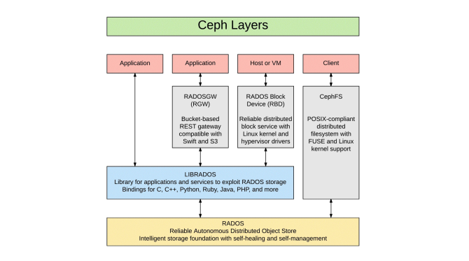
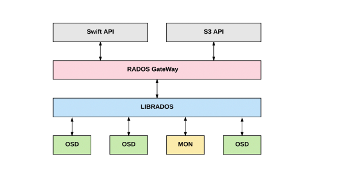

## 1. Thành phần trong CEPH, Service và cách hoạt động

- Các daemon và compoment xây dựng lên Ceph backend
     - RADOS
     - Monitor ( MONs )
     - ODSs
     - Ceph manager
     - RGW

- Các dịch vụ cho người dùng
    - Block
    - Object
    - File

## 2. Các thành phần core

### 2.1 : Reliable Autonomic Distributed Object Store (RADOS)

- Nền tảng của Ceph được xây dựng từ RADOS, cung cấp một nền tảng backend chung cho nhiều dịch dịch người dùng

- RADOS là một object storage layer cung cấp nền nền tảng cho phép các user service layer ở trên làm việc với các layer ở dưới nó 
- RADOS có khả năng cung cấp :
    - Highly available with no single point of failure (SPoF)
    - Độ tin cậy và bền bỉ
    - Tự sứa chữa
    - Tự quản lý 
    - Khả năng cung cấp
    - Khả năng mở rộng
    
- RADOS cung cấp khả năng quản lý dữ liệu phân tán trong Ceph. Độ bền bỉ và tính sẵn sàng của dữ liệu được duy trì và có khả năng tự phục hồi và khả năn cần bằng tải khi thêm và xóa các thành phần trong cụm. Nền tảng của RADOS là thuật toán CRUSH. RADOS chắc chắn răng các dữ liệu được replicate và công việc này được duy trì mọi lúc , đảm bảo tính toàn vẹn và không ảnh hưởng đến dịch vụ của khách hàng

### 2.2. MON

- MON trong Ceph trong chỉ để them dõi các trạng thái trong cụm, chúng còn thực hiện nhiều tác vụ khác .Khi làm việc với các ODS, Ceph mon ( ceph-mon) làm việc với các MON khác, ODS, u nhằm quy trì và phân tối thông tin quan trọng khác nhau về hoạt động của cụm. Như các thành phần các, MON cần xây dựng tính dự phòng cho chúng trong khi vẫn đảm bảo tính nhất quán . MON sử dụng thuật toán PAXOS cho quá trình qorum của mình. Trong môi trường production,  khuyến nghị nên có 3 MON trong cả cụm, và chỉ số split brain nên bằng hoặc nhỏ hơn MON/2. \
- Các dữ liệu MON quản lý bao gồm các map của OSD,các mon khác, placement group và CRUSH map ( xác định nơi dữ liệu có thể đặt và tìm thấy trong bể chứa)

## 2.3. Object Storage Daemons (OSDs)

- OSD cung cấp cho người dùng khả năng lưu trữ trong bể chứa Ceph. OSD là một tiến trình ( ceph-osd ) chạy trên host,  quản lý việc ghi , đọc và tính xác thực của dữ liệu . Các storage device thường được quản lý bởi một ODS thường là một Hard Disk Drive (HDD) or Solid State Device (SSD ). Kiến trúc lưu trữ dưới một OSD có thể là simple software or  HBA RAID volume to LUNs or iSCSI targets oncexternal storage arrays, SanDisk's InfiniFlas .
- Ceph tổ chức dữ liệu  trên đơn vị gọi là Placement Groups (PGs). Mỗi PG được quản lý và quyêt định hành động trong cụm . Các PG sẽ gồm các tập hợp các object . 
Mỗi PG duy trì nhiều bản sao trên các OSD, node, rack hoặc thậm chí các trung tâm dữ liệu khác đảm bảo về tính sẵn sàng của dữ liệu . Theo mặc định, Ceph duy trì ba bản sao dữ liệu được nhận ra bằng cách đặt một bản sao của mỗi PG trên ba OSD khác nhau nằm trên ba máy chủ khác nhau . Tại bất kỳ thời điểm nào, một bản sao OSD của một PG được chỉ định là chính và các PG còn lại sẽ là phụ ; Một điểm khác biệt quan trọng là tại thời điểm này ác , các request đọc và write  ghi được hướng vào OSD chính. Các PG đặt trên các OSD phụ được coi là nô lệ  và đảm bảo tính nhất quán dữ liệu bằng ccsh đồng bộ dữ liệu với PG chính. 

### 2.4. Ceph Manager

- Ceph Manager daemon ( ceph-mgr ), hoạt động với các MON cung cấp quản lý toàn cục 

- Các chứng năng chính của ceph manager
    - Management of drive and chassis status/locator LEDs
    - Creating and managing a map of clients such as rbd-mirror and RADOS
    - Gateway, which were previously less well-integrated
    - Holistic management of Ceph's scrubs
    - Richer management of reweighting and rebalancing operations.
    - Integration with external inventory systems such as RackTables, NetBox,
    - HP SIM, and Cisco UCS Manager
    - Interface for monitoring/metrics systems such as Nagios, Icinga, Graphite,
    - and Prometheus

### 2.5. Rados Gateway 

-  Rados RGW server có khả năng cung cấp các API interface có khả năng khả dụng cao , dể tổ chức dữ liệu dưới  các object ( đối tượng ). Có khả năng tính tích hợp với Amazon's S3 and OpenStack's Swift và tích hợp trực tiếp Keystone intentity service. 

-  Rados gatway cũng giống như MDS, không cần sử dụng trong trường hợp chỉ sử dụng block và file storage 

### 2.5. Admin host

- Việc quản lý ceph thường thông qua CLI. Các tác vụ có thể là làm việc với một hoặc nhiều MON. 

### 2.6.CephFS MetaData server (MDS)

- Để quản lý cấc dữ liệu dưới kiểu tổ chức file-base ( tree). Ceph cần bổ sung một số metadata tới dữ liệu trong loại storag này
    - Permissions
    - Hierarchy
    - Names
    - Timestamps
    - Owners
    - Mostly POSIX compliant. mostly.

## 3. Các dịch vụ core

### 3.1. RADOS Block Device (RBD)

- RBD cung cấp các presents block storage hoặc được biết đến là volume . Với RDB có thể cung cấp các block VxVM (TM), Solaris Disk Suite (SVM)(TM), the Linux MD/LVM system, ISCSI
or Fibre Channel (TM) appliance, or even a ZFS (TM) ZVOL. 

- Có thể xây dựng các filesytem khi sử dụng RBD volume, thường sử dụng để boot các VM trong trường hợp các hypervisor sẽ là client cho RBD service và các volume sẽ làm việc với máy máy khách thông qua virtio hoặc các device khác. 
- RBD volume thường được sử dụng cho các máy ảo bao và làm việc với  OpenStack Cinder và Glance, nhưng ứng dụng

## 3.2 .RADOS Gateway (RGW)

- Ceph natively manages objects, but it is crucial to not confuse this with other uses of the name, especially in relation to object storage in the vein of OpenStack Swift or Amazon's S3() service. The Ceph RGW service can be used to provide object storage compatible with both Swift and S3. Note that when used, the Ceph RGW service utilizes one or more dedicated pools  and cannot be used to access RBD volumes or other types of data that may live within your cluster in their own pools. This service is provided RESTfully with a familiar HTTP/HTTPS interface.

## 3.3. CephFS

- CephFS is somewhat akin to NFS (TM) but not directly analogous. In fact, one can even run NFS on top of CephFS! CephFS is designed for use on well- behaved servers, and is not intended to be ubiquitously mounted on user esktops. You can use an operating system kernel driver to mount a CephFS filesystem as one would a local device or Gluster network filesystem. There is also the option of a userspace FUSE driver. Each installation must weigh the two mount methods: FUSE is easier to update, but the native kernel driver may provide measurably better performance.