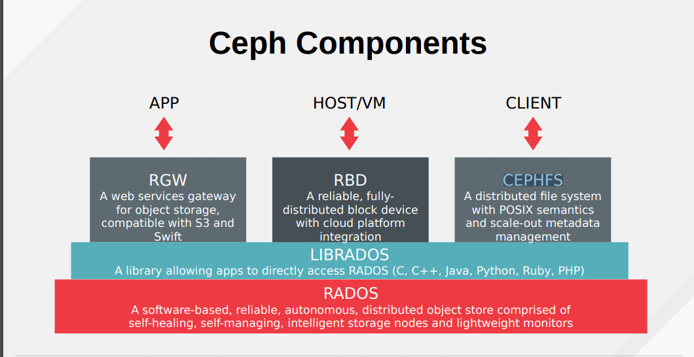

## Thành phần trong CEPH

## 1 Kiếm trúc trong CEPH

- CEPH có khả xây dựng block storage, file storage, object storage trên một hệ thống tập trung . CEPH mang lại độ tin tưởng cao, dễ  dàng quản lý  mà hoàn toàn miễn phí . CEPH đáp ứng được khả năng mở rộng đáp uiwngs hàng hàng client truy cập vào patabytes tới extabye dữ liệu trong khi vẫn đáp ứng khả năng repilcate dữ liệu. Tất cả các Ceph storage cluster đầu bắt đầu từ xây dựng CEPH node, network , Ceph storage cluster. Một Ceph storage cluster yêu cầu ít nhất : một Ceph Monitor, Ceph Manager, Ceph ODS ( Object storage Deamon ). Đối với Ceph filesysem yêu cầu thêm metadata

- CEPH Monitor ( MON) : CEPH monitor theo dõi sức khỏe của các cluster bằng cách lưu trữ các trạng thái của cluser. MON  map thông tin của các thành phần  bao gồm OSD map, MON map, PG map và CRUSH map. Các cluster theo dõi trạng thái các node sau đó gửi về cho MON. Các MON không thực sự lưu trữ dữ liệu và sẽ gửi về OSD

- CEPH metdata Server ( MDS ) : MDS theo giói hệ thống tập tin và lưu trữ metadata cho CephFs filesystem. CEPH block device và RADOS không yêu cầu metadata vì vậy sẽ không cần làm việc với MDS. MDS không làm việc trực tiếp với các client, nên sẽ giảm một điểm failure . 

- RADOS : Reliable Autonomic Distributed Object Store (RADOS) nền tảng cho CEPH storage cluster.  Mọi thứ được lưu trong CEPH đều là hiển thị như mội đối tượng , nhiệm vụ cả RADOS object store là lưu trữ các đối tượng này mà không quan tâm đến kiểu dữ liệu gốc. . Ngoài ra các layer trong RADOS đảm nhiệm đảm bảo tính nhất quán của dữ liệu trong Cluster . Để làm được điều này, nó thực hiện repication, failure dection, recovery. cũng như di chuyển và cân bằng tải giữa các cụm . " self-healing, self-managing, intelligent storage nodes and lightweight monitors"
- CEPH object storage device ( ODS - A physical or logical storage unit (e.g., LUN).) : Khi các client thực hiện write tới cluster, dữ liệu được gửi vào các ODS dưới dạng object. Thực chấy đây là thành phần duy nhất của CEPH Cluster lưu trữu dữ liệu. và cũng  nơi duy nhất nhận yêu cầu read từ các client. Thông thường, các ODS được gán một ổ cứng vật lý vào cluster. Vì vậy, tổng số các physical disk trong một Cluster sẽ bằng số ODS daemon đang hoạt động .

- Ceph exposes  RADOS; có thể  access RADOS qua : 
    - librados : thư viện cung cấp khả năng làm việc dễ đàng cho RADIOS, hỗ trợ các ngôn ngữ PHP, Ruby, Java, C và C++. Nó cung cấp một giao diện cho Ceph storage cluster  ( RADOS), cũng như các dịch vụ các liên quan đến RADOS như RBD, RGW, and CephFS

- Để lưu trữ và truy cập dữ liệu , thành phần sau quản lý với các storage system khác nhau .
   - RADOS block devices (RBDs) : được biết đến với CEPH block storage, cung cấp các block storage theo hướng persistent, có khả năng thin-provision, resizable, và dữ liệu phân toán trên nhiều ODS. 
   - RADOS gateway interface : ( RGW ) : OpenStack Object Storage and Amazon-S3 compatible RESTful interface (see RADOS_Gateway).
   - CephFS :   Sử dụng như file-baste system , hệ thống tệp tuân thủ POSIX.

- Manager : Ceph-manager  đảm nhiệm theo dõi các metric và trạng thái của các Cluster bao gồm : trạng thái hiện tái của cụm,  storage utilization, các chỉ số hiệu năng và chỉ số tải của hệ thống. Ceph daemons cũng bao gồm gồm các chường trình python nhằm quản lý và xuất các thông tin về các Cluster , bao gồm Ceph Dashboard và Rest API . Yêu cầu ít nhất 2 manager daemon cho high availability.

- CEPH lưu trữ dữ liệu dưới dạng đối tượng trong các  logical storage pools. Sử dụng thuật toán CRUSH ( Controlled Replication Under Scalable Hashing. It is the algorithm Ceph uses to compute object storage locations. ) , Ceph tính toán tìm các placement group  phù hợp nhất để lưu trữ các đối tượng, sau đó xác định OSd ( ceph-ods ) phù hợp để các placement group . Thuật toán CRUSH cho phép Ceph storage Cluster mở rộng, cân bằng tải và có khả năng phục hồi linh hoạt 

## 2. THE CEPH STORAGE CLUSTER

- CEPH cung cấp Storage Cluster có khả năng mở rộng vô hạn rựa vào Rados . Một Ceph storage cluster bao gồm 2 loại daemon .
   - Ceph Monitor : một cluster ceph monitor có khả năng high availability để đảm bảo một daemon monitor có thể ở trạng thái fail
   - Ceph OSD Daemon : một CEPH ODS deamon sẽ kiểm trang trạng thái sau đó gửi tới các ODS khác và tới monitor

- STORING DATA
   - Khi Ceph Storage cluster nhận được dữ liệu từ Ceph Client - từ block device, file device, object device sẽ sử dụng librados để lưu các dữ liệu theo kiểu đối tượng. Mỗi đối tượng tương ứng với mội file trong filesytem được đặt tại  Object Storage Device. CEPH ODS Daemons xử lý read/write tới các storage device. 
   - Ceph OSD deamon lưu trữ các dữ liệu dưới dạng object trên một kho chứa phẳng. Mỗi object sẽ có  identifier, binary data, and metadata 
   