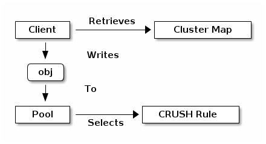
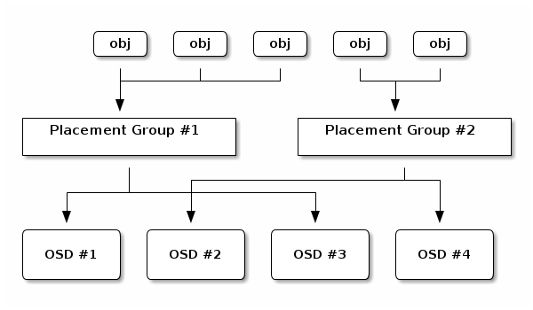
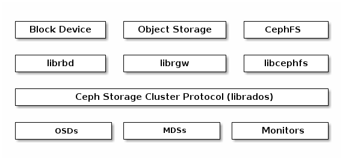

## 1. Intro

- CEPH có thể cung cấp  object, block, and file storage trên một hệ thống tập trung .. Ceph tăng tính tin cậy, khả năng dễ dàng quản lý và miễn phí. Ceph có thể  đáp ứng cho hàng ngàn người dùng, vởi khả năng mở rộng và lưu trữ  petabytes tới exabytes. Ceph Node được phần cứng và tăng khả linh động cũng như thông minh hóa. Các Ceph Storage Cluster chứa nhiều Ceph node, với khả năng liên lạc, cung cấp các mối quan hệ trong cả cụm, cũng như cung cấp khả năng nhân rộng bản ghi và phân tán dữ liệu 

## 2 THE CEPH STORAGE CLUSTER

- Ceph cung cấp Ceph Cluster Storage với khả năng mở rộng vô hạn dựa trên RADOS: A Scalable, Reliable Storage Service for Petabyte-scale. RADOS đảm nhiệm tính nhất quán của dữ liệu , khả năng lưu trữ dự phòng cho các bản ghi, khả năng phát hiện lỗi . và khả năng tự khôi phục . 

- Một CLuster Storag cung cấp bởi Ceph  bao gồm 2 loại daemon :
    - Ceph Monitor
    - Ceph OSD Daemon

- Ceph Monitor duy tri các Cluster Map. Một cụm Monitor cung cấp khả năng cả cụm vẫn hoạt động bịnh thường trong trường hợp 1 MON không hoạt động . 
- Ceph OSD Deamon cung cấp khả năng tự kiểm tra trạng thái của nó và các OSD khác sau đó gửi về các MON

- Storage Cluster Clietn và OSD sử dụng thuật toán CRUSH để tính toán hiệu nơi sẽ đẩy dữ liệu xuống. Để làm việc với Ceph Storage Cluster , Ceph cung cấp librados như một interface để làm việc, cung cấp sẵn các điểm vào cho librados là các service interfaces 

## 3. Storing Data

- Ceph Storage CLuster nhận dữ liệu từ Ceph Client ( các thành phần có thể truy cập vào  Ceph Storage Cluster.) - có thể làm Ceph Block Device, Ceph Object Storage, the Ceph Filesystem  , chính là các service interface được librados cung cấp, tất cả dữ liệu được nhận từ các service interface đều được Storage Cluster lưu trữ dưới dạng object ( đối tượng) trong hồ chứa .  Each object corresponds to a file in a filesystem, which is stored on an Object Storage Device. - Mỗi object chính xác là các file trong filesystem được lưu trữ trên Object Storage Device ( OSD ). Ceph OSD daemon đảm nhiệm writ/read dữ liệu trên các storage disk

- Ceph OSD lưu trữ  dữ liệu dưới dạng object trên một namespace phẳng. Tùy thuộc vào Ceph Client các object này có thể chứa identifier, binary data, và metadata  và có hiệu lực trên cả cụm

## 4. SCALABILITY AND HIGH AVAILABILITY

- Với kiểu kiến trúc bình thường, các client sẽ nói chuyện  với một điểm trung tâm (  gateway, broker, API, facade), cung cấp khả năng truy cập tập trung và duy nhất cho cả hệ thống tuy nhiện đây cũng là single point of failure chí mạng của hệ thống. 

- Ceph loại bỏ các interface tập trung, cho phép các Client làm việc trực tiếp với  Ceph OSD Daemons .Để loại bỏ tập trung hóa, Ceph sử dụng thuật toán CRUSH. đồng thời CRUSH hạn chế  hiện tượng thút cổ chai .

## 5. CRUSH algorithm

- Cả Ceph client và Ceph OSD sử dụng thuật toán CRUSH để tính toán về vị trí cho các object.  CRUSH cung cấp khả năng quản lý tốt hơn so với cách kỹ thuật cũ, cung cấp khả năng mở rộng mà hoàn toàn trong suốt với Client . CRUSh tăng khả năng tự phục hồi cho Cluster bằng cách sao chép dữ liệu ( data repli)
- CRUSH phân tán dữ liệu dựa vào các map item gọi là CRUSH MAP. 

## 6. CLUSTER MAP

-  Ceph Clients and Ceph OSD Daemons sẽ có 5 map được gọi Cluster Map

- Monitor MAP : chứa fsid cluster, hostname, IP, port cuả mỗi MON. 
- The OSD Map : chứa fsid cluster, bao gồm : list pool, replite min, default size, PG number, list OSD và status của chúng. 
- PG MAP : chứa PD version, chứa các thông tin của mỗi placement group trên mỗi pool
- CRUSH Map : chứa list storage device, và các rule khi đặt dữ liệu
- MDS Map : chứa các list metdata  servetr đang sử dụng bởi các pool

## 7. HIGH AVAILABILITY AUTHENTICATION

- Để xác thực người dùng và chống lại man-in-the-middle attack . Ceph sử dụng cephx để authen cho các service và deamon

- Ceph sử dụng cơ chế shared key, cả client và monitor cluster đều chứa chung một bản ghi, khi tham gia chứng thực các shared_key sẽ có cả 2 phía đảm bảo key không thể bị lộ. Trong Ceph , các t Ceph clients sẽ làm việc trực tiếp  với các OSD. 

## 8. SMART DAEMONS ENABLE HYPERSCALE

## 9. ABOUT POOLS

- Ceph storage system  hỗ trợ khái niệm  "pool" , chứa các logical partion để lưu trữ các object. 

- Client nhận Cluster Map từ Ceph Monitor , và write object xuống các pool. Với thống số "pool size" là số replicate. dựa vào crush rule và placement groups sẽ xác định cách Ceph đặt dữ liệu như thế nào .

- Trên mỗi pool sẽ chứa 3 thông số cơ bản : 
    - Access permission 
    - Number of Placement Group
    - Crush rule to use

- http://docs.ceph.com/docs/mimic/rados/operations/pools/#set-pool-values  

## 10. MAPPING PGS TO OSDS

- Mỗi Pool sẽ được định nghĩa số  placement groups. Crush map ( gắn ) PGs tới các OSD một cách linh động . Khi Ceph client lưu trữ dữ liệu, CRUSH sẽ map các object này xuống các placment group

- Mapping object tới placement groups sẽ tạo một layer gián tiếp giữa Ceph OSD và Ceph Client. Việc gắn các object tới các placment giúp linh động các layer OSD, CEPH có thể cân bằng tại khi có một OSD mới tham gia vào storage cluster. 

## 11. CALCULATING PG IDS

- Khi một client được bind tới Ceph Monitor, nó sẽ nhận được một bản copy mới nhất Cluster MAP mà MON này đang nắm giữ. . Client sẽ nhaanj được các thông số từ Cluster MAP trừ object locations thay  vì đó sẽ được tính toán.

- Ceph lưu trữ dữ liệu trên 1 pool "pool_ex_1". Khi một client yêu cầu đặt data trên pool  "pool_ex_1" với một object_named, nó sẽ tính toán placement group .
- Các bước tính toán Placment Group
    - Client input vào pool_name và object_id
    - Ceph nắm giữa objec_id và hash 
    - Ceph list map PG và xác định PG_ID
    - Ceph lấy số Pool ID được cung cẫp từ Pool name
    - Ceph kết hợp  pool ID và  PG ID

## 12. CEPH CLIENTS

- Ceph Client bao gồm các service interface :
    - Block Devices: The Ceph Block Device (a.k.a., RBD) service provides resizable, thin-provisioned block devices with snapshotting and cloning. Ceph stripes a block device across the cluster for high performance. Ceph supports both kernel objects (KO) and a QEMU hypervisor that uses librbd directly–avoiding the kernel object overhead for virtualized systems.
    - Object Storage: The Ceph Object Storage (a.k.a., RGW) service provides RESTful APIs with interfaces that are compatible with Amazon S3 and OpenStack Swift.
    - Filesystem: The Ceph Filesystem (CephFS) service provides a POSIX compliant filesystem usable with mount or as a filesytem in user space (FUSE).

Updating ....

http://docs.ceph.com/docs/master/architecture/